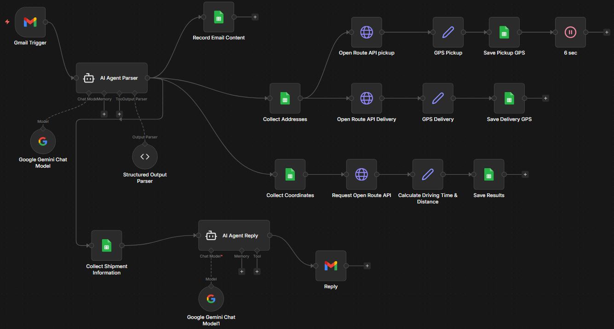

# InternTrack AI Agent

InternTrack AI Agent is a real-time, AI-powered email intelligence system built using n8n.  
It monitors incoming emails, identifies internship-related communication using Gemini-based AI agents, and instantly sends WhatsApp alerts to ensure no opportunity is missed.

---

## Architecture

Below is the architecture of the InternTrack AI Agent workflow.



---
## Problem Statement

As a student actively applying for summer internships across companies, startups, research labs, and universities, I receive a large number of emails daily. These include interview invitations, application updates, recruiter outreach, document requests, and selection or rejection notifications.

Since it is not practical to monitor email continuously, important messages can easily be overlooked among newsletters, promotions, and unrelated communication. Missing a time-sensitive internship email can directly impact career opportunities.

To solve this, I developed **InternTrack AI Agent** — an autonomous, event-driven system that monitors incoming emails in real time and proactively notifies me via WhatsApp whenever an internship-related email is detected.

---

## Solution Overview

InternTrack AI Agent operates as a real-time workflow:

1. A new email arrives.
2. The system automatically triggers.
3. An AI classification agent determines whether the email is internship-related.
4. If relevant, a summarization agent generates a concise summary.
5. A WhatsApp alert is sent containing:
   - Sender address
   - Subject line
   - Short AI-generated summary
   - Direct link to the email

This converts passive inbox checking into proactive opportunity tracking.


## Workflow Explanation

### 1. Gmail Trigger (Event-Based)
- Listens for new incoming emails in real time.
- Acts as the entry point of the system.
- No manual scheduling required.

---

### 2. Mail Classifier Agent (Gemini)

This is the first AI agent in the workflow.

**Purpose:**
- Determine whether the email is internship-related.
- Classify the email type.
- Output structured decision data.

**Input:**
- Sender (`from`)
- Subject
- Email body
- Date


If the email is not related to internships, the workflow stops here.

---

### 3. IF Node (Decision Layer)

* Checks whether `isInternship == true`.
* Optionally checks `confidence >= threshold`.
* Filters out irrelevant emails.
* Only relevant emails continue to the next stage.

---

### 4. Merge Node

* Combines:

  * Original email data
  * Classification results
* Preserves full context for summarization.

---

### 5. Mail Summarizer Agent (Gemini)

The second AI agent in the pipeline.

**Purpose:**

* Generate a concise and clear summary.
* Prepare a WhatsApp-ready alert message.

**Input:**

* Email content
* Sender
* Subject
* Classification metadata

---

### 6. WhatsApp Alert Module

* Sends instant WhatsApp notification.
* Includes:

  * Sender address
  * Subject line
  * Short summary
  * Direct link to the email

This ensures immediate awareness without needing to open the inbox.

---

## Key Features

* Real-time email monitoring
* Dual AI-agent architecture
* Internship-specific classification
* Confidence-based filtering
* Instant WhatsApp notifications
* Fully automated workflow
* Modular and extensible design

---

## Agent Design Philosophy

InternTrack AI Agent follows a multi-agent structure:

### Mail Classifier Agent

Handles decision-making and relevance detection.

### Mail Summarizer Agent

Handles summarization and human-readable alert generation.

This separation improves clarity, modularity, and scalability.

---

## Use Cases

* Summer internship tracking
* Research internship monitoring
* Campus placement alerts
* Recruiter outreach detection
* Application status monitoring
* Fellowship and RA position updates

---

## Technologies Used

* n8n (workflow orchestration)
* Gmail Trigger
* Google Gemini (LLM-based AI agents)
* WhatsApp Business Cloud API
* Conditional Logic Nodes
* Merge and Data Transformation Nodes

---

## Demo

<!-- Replace with your demo video link -->

[Watch Demo Video](https://your-demo-link-here)

---

## Future Enhancements

* Automatic Gmail labeling for internship emails
* Database logging and analytics
* Priority scoring and ranking system
* Multi-category classification (jobs, grants, collaborations)
* Multi-channel alerts (Telegram, Slack, SMS)

---

## Conclusion

InternTrack AI Agent transforms email monitoring into an intelligent, proactive system.
By combining real-time triggers with AI-driven classification and summarization, it ensures that no internship opportunity is missed - even when continuous inbox monitoring is not possible.

```
```
